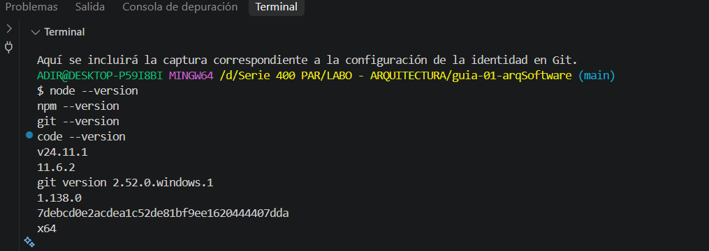
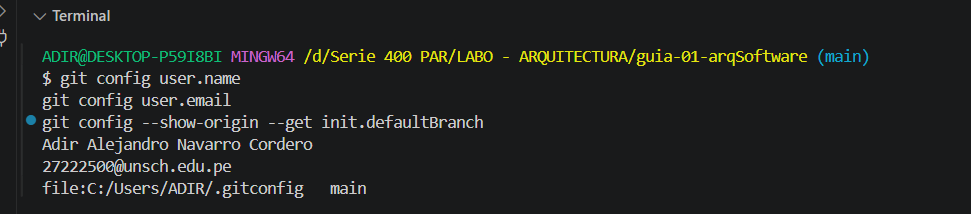

# Guía 01 - Arquitectura de Software

## Datos del estudiante

**Estudiante:** Adir Alejandro Navarro Cordero  
**Código:** 27222500  
**Curso:** IS-488 Arquitectura de Software  
**Docente:** Ing. Lizbeth Jaico Quispe  
**Semestre:** 2026-II

## Descripción del curso

El curso de Arquitectura de Software aborda los principios y decisiones necesarias para organizar y estructurar un sistema de software, considerando aspectos como mantenibilidad, escalabilidad, seguridad y rendimiento.

## Expectativas del curso

Espero fortalecer mis conocimientos en arquitectura de software y aprender a diseñar aplicaciones con una estructura organizada y mantenible. También espero mejorar mis habilidades en programación, Git, GitHub y desarrollo de software mediante proyectos prácticos.

## Evidencias

### Paso 01 - Verificación del entorno

### Paso 02 - Configuración de Git

